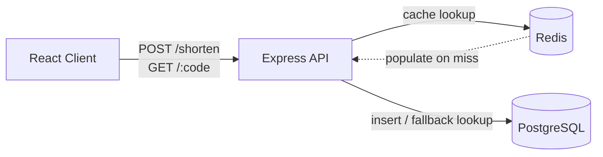

# URL Shortener

A URL shortening service built with Express, PostgreSQL, and Redis.

## Screenshot


## Architecture



On a redirect, the API checks Redis first; on a cache miss it falls back to PostgreSQL and repopulates the cache.

## Tech Stack

- **Express** — HTTP server
- **PostgreSQL** (`pg`) — persistent storage for URL mappings
- **Redis** (`ioredis`) — caching layer
- **nanoid** — short ID generation
- **cors** — cross-origin request support

## Getting Started

```bash
npm install
npm test
```

## TODO

- [ ] Sequential ID + Base62 Encoding
